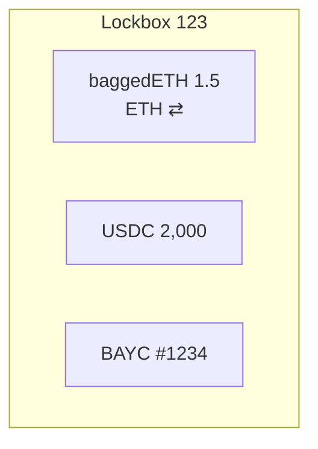

# Multi-asset support

Lockboxes can bundle **ETH, any ERC-20 tokens, and any ERC-721 NFTs in a single transaction**. This flexibility lets you consolidate an entire portfolio behind one soul-bound NFT while still preserving precise, per-asset accounting on-chain.

---

## Supported standards

| Asset type | Standard | Notes |
|------------|----------|-------|
| Native ETH | – | Deposited via `payable lock{value:…}` or by sending ETH to the helper `Deposits` contract. |
| Fungible tokens | ERC-20 | No allow-list—the delta-tracking logic accepts *any* compliant token, including fee-on-transfer or rebasing variants. |
| Non-fungible tokens | ERC-721 | Any collection. TokenId is stored in the `amount` field of the Lock struct. |

ERC-1155 support is in active R&D; the current recommendation is to wrap each id in an ERC-721 wrapper if you need multi-id deposits.

---

## Batch deposit UX

On the dApp you can select up to **three distinct assets** per bundle. This cap minimises the risk of a transaction running out of gas during peak network congestion.

!!! tip "Why three?"
    Gas costs scale roughly linearly with the number of assets. Testing shows sub-200k gas for 3 assets keeps the TX under 30 seconds on mainnet at 30 gwei.

The workflow:

1. **Portfolio → Create Lockbox**  
2. Tick the assets (ETH, ERC-20, NFTs).  
3. Confirm & pay the platform fee.  
4. Sign the mint transaction that transfers each asset to the contract and mints the soul-bound NFT.

---

## Internal storage shape

The contract keeps separate mappings per asset class (see [Secure asset storage](secure-asset-storage.md)) so a withdrawal can target *just one* balance without touching the others.

Withdrawals may also be batched—e.g. release all ERC-20s in a single call. Unaffected balances remain mapped to the NFT.

---

## Gas profile

| Action | Gas (mainnet, ≈)|
|--------|-----------------|
| Deposit 1× ERC-20 | 55k |
| Deposit 1× NFT | 80k |
| Deposit 1× ETH | 30k |
| Mixed bundle (ETH + ERC-20 + NFT) | 155k |

> Figures include calldata + event logging; exact usage varies with token implementation.

Lockx supports:

* **ETH** – native transfers via `lock{value:…}`
* **ERC-20** – any standard token
* **ERC-721** – single NFTs
* **ERC-1155** – individual ids (batch lock coming soon)

Each lock stores the token address and—if applicable—the id.
