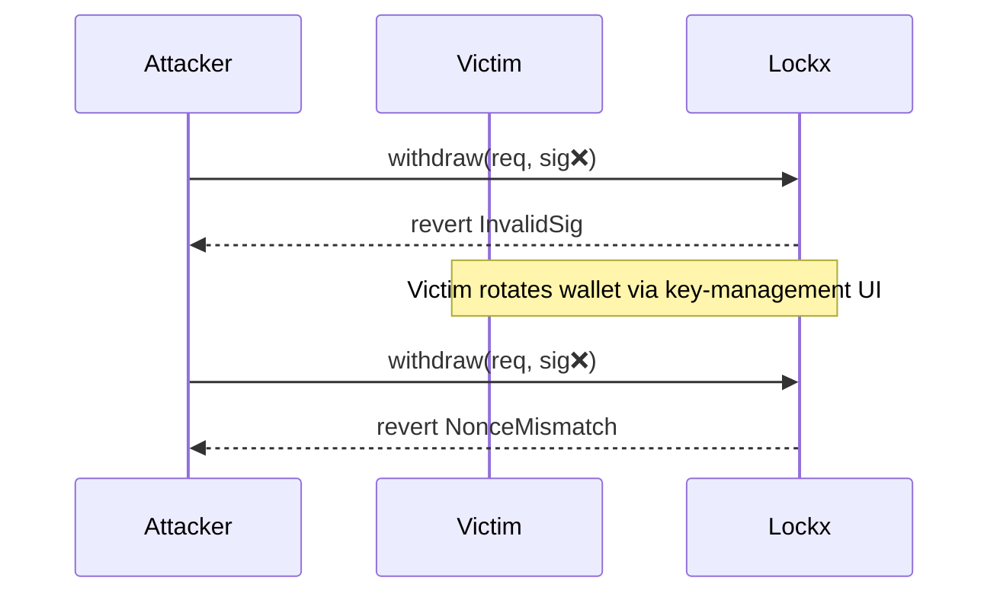

# Wallet attack protection

Lockx dramatically reduces the blast-radius of a compromised hot wallet. Even if an attacker gains your private key they still need **one of two extra factors** before any asset can leave the Lockbox:

1. A valid EIP-712 withdrawal signature created with the *current* session key (2FA).  
2. Or to simply wait until the time lock expires.

---

## 2-factor signature flow

* **Session-bound** – every signature includes a `nonce` and 3-hour `deadline`.  
* **Whitelist-bound** – signatures are domain-separated; they only work on the official contract address & chainId.

An attacker therefore needs *live* access to the victim’s wallet at the exact moment they sign—phishing old signatures won’t help.

---

## Key rotation & emergency cancel

If you suspect compromise:

1. Open the dApp → **Key management → Rotate keys**.  
2. The contract bumps the `nonce` for every outstanding lock.  
3. All previously signed withdrawal messages become **forever invalid**.

Alternatively you can **cancel** a lock before it is funded, costing only gas.

---

## Time-lock buffer

Many users choose to set a 24h `unlockTime`. If their device is stolen they have a full day to rotate or move assets before the time barrier lifts.

!!! info "Balance-view only"
    The public `getFullLockbox()` view lets you confirm that no unauthorised deposits or withdrawals occurred during the incident—handy for insurance claims.

If your hot wallet is compromised, funds inside Lockx stay safe because an attacker needs *either* the second-factor signature or to wait out the time lock. You can rotate keys or cancel the lock before that.
