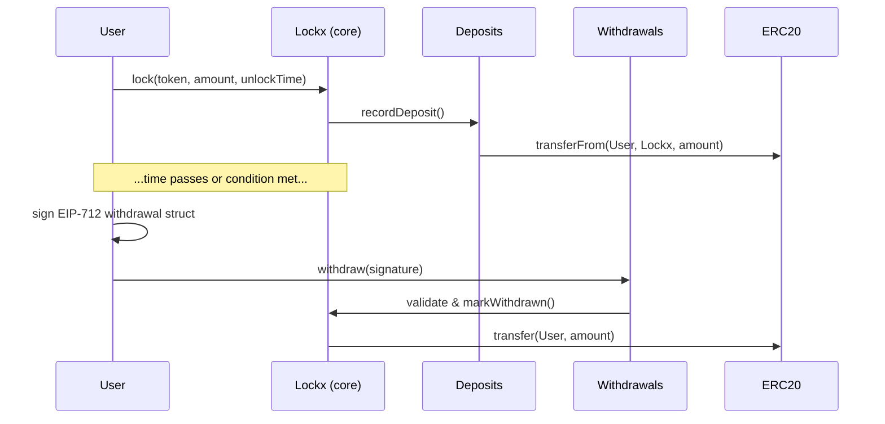

# Contract overview

This page explains how the core Lockx contracts fit together and how a typical asset life-cycle works. The diagram below is conceptual—actual addresses and method names may differ slightly.

1. **Lockx** holds the authoritative record of each lock (owner, asset, amount, unlock conditions).
2. **Deposits** is a thin helper that receives assets and emits easy-to-filter events.
3. **Withdrawals** validates EIP-712 signatures (or time-based expiry) and initiates release.

Only Lockx stores state; the helper contracts keep the external surface small and auditable.

[See the full data model →](data-model.md)

[See typical flows →](typical-flows.md)
