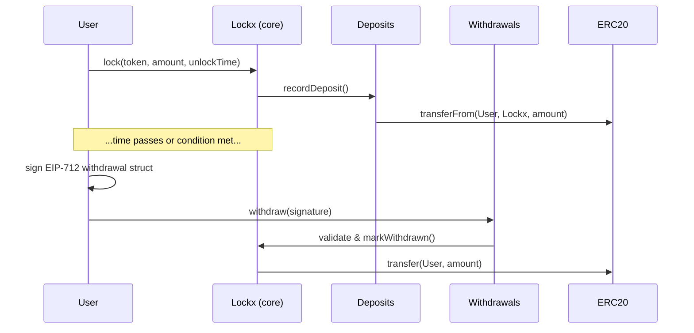

# Contract overview

This page explains how the core Lockx contracts fit together and how a typical asset life-cycle works. The diagram below is conceptual—actual addresses and method names may differ slightly.

1. **Lockx** holds the authoritative record of each lock (owner, asset, amount, unlock conditions).
2. **Deposits** is a thin helper that receives assets and emits easy-to-filter events.
3. **Withdrawals** validates EIP-712 signatures (or time-based expiry) and initiates release.

Only Lockx stores state; the helper contracts keep the external surface small and auditable.

### Data model (simplified)

| Field | Type | Notes |
|-------|------|-------|
| `owner` | `address` | Wallet that can authorise withdrawal |
| `token` | `address` | Zero address means native ETH |
| `amount` | `uint256` | For ERC-721 the tokenId is encoded here |
| `unlockTime` | `uint40` | Unix timestamp after which a withdrawal *may* be executed |
| `nonce` | `uint32` | Bumps on every withdrawal to avoid replay |

The full struct lives in `ILockx.Lock`.

### Typical flows

* **Simple time lock** – User locks tokens with an unlockTime; later they call `withdraw()` directly—no signature needed.
* **Guarded withdrawal** – User locks but enforces signature + nonce; front-end helps sign the message and submits it.
* **Third-party unlock** – Custodial recovery or DAO; anyone can relay a valid signature, but funds still go to `owner`.

Continue to the per-contract pages for deeper details.
