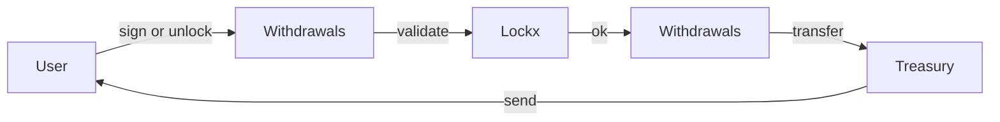

# Withdrawals contract

`Withdrawals.sol` handles the final step of releasing assets back to the owner. It verifies signatures, enforces nonces, and performs the actual token transfer from the Lockx treasury to the user.

## Responsibilities

* Validate an EIP-712 `WithdrawRequest` signed by the lock owner **or** ensure the unlock time has passed.
* Check the nonce matches the on-chain value and bump it to block replays.
* Perform the token/ETH transfer.
* Emit a concise `Withdrawn` event that indexers can watch.

Everything else—storing lock data, calculating keys, recording amounts—lives in `Lockx`.

## WithdrawRequest struct

```solidity
struct WithdrawRequest {
    bytes32 key;     // lock identifier
    uint256 amount;  // amount to withdraw (<= locked amount)
    uint32  nonce;   // current nonce for the lock
    uint40  deadline;// optional expiry for the signature
}
```

If the caller is the owner **and** `block.timestamp >= unlockTime`, the signature may be skipped by sending an empty `bytes`.

## Flow diagram



## Error messages

| Code | Meaning | User action |
|------|---------|------------|
| `ERR_SIG_EXPIRED` | `deadline` has passed | Re-sign with a new deadline |
| `ERR_BAD_NONCE` | Nonce mismatch | Fetch latest nonce then sign again |
| `ERR_TOO_SOON` | Unlock time not reached | Wait until unlockTime |
| `ERR_NOT_OWNER` | Caller not owner and no valid signature | Ask owner to sign |
