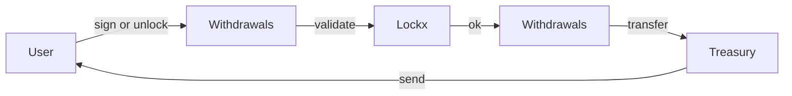

# Withdrawals contract

`Withdrawals.sol` handles the final step of releasing assets back to the owner. It verifies signatures, enforces nonces, and performs the actual token transfer from the Lockx treasury to the user.

## Responsibilities

* Validate an EIP-712 `WithdrawRequest` signed by the lock owner **or** ensure the unlock time has passed.
* Check the nonce matches the on-chain value and bump it to block replays.
* Perform the token/ETH transfer.
* Emit a concise `Withdrawn` event that indexers can watch.

Everything else—storing lock data, calculating keys, recording amounts—lives in `Lockx`.

## WithdrawRequest struct

```solidity
struct WithdrawRequest {
    bytes32 key;     // lock identifier
    uint256 amount;  // amount to withdraw (<= locked amount)
    uint32  nonce;   // current nonce for the lock
    uint40  deadline;// optional expiry for the signature
}
```

If the caller is the owner **and** `block.timestamp >= unlockTime`, the signature may be skipped by sending an empty `bytes`.

## Flow diagram



## Error messages

| Code | Meaning | User action |
|------|---------|------------|
| `ERR_SIG_EXPIRED` | `deadline` has passed | Re-sign with a new deadline |
| `ERR_BAD_NONCE` | Nonce mismatch | Fetch latest nonce then sign again |
| `ERR_TOO_SOON` | Unlock time not reached | Wait until unlockTime |
| `ERR_NOT_OWNER` | Caller not owner and no valid signature | Ask owner to sign |

---

## Function walkthrough

### withdrawETH
```solidity
function withdrawETH(uint256 tokenId,
                     bytes32 messageHash,
                     bytes signature,
                     uint256 amountETH,
                     address recipient,
                     bytes32 referenceId,
                     uint256 signatureExpiry) external
```
* **Purpose** – release ETH to any recipient after signature authorisation.
* **Checks**  
  • Caller owns the Lockbox  
  • `recipient` ≠ `0x0`  
  • `block.timestamp ≤ signatureExpiry`  
  • Valid EIP-712 signature via `verifySignature`  
  • `_ethBalances[tokenId] ≥ amountETH`
* **Flow**  
  1. Verify signature (OperationType `WITHDRAW_ETH`).  
  2. Subtract amount from balance mapping.  
  3. Call `.call{value: amountETH}`; revert on failure.  
  4. Emit `Withdrawn`.
* **Gas notes** – storage refund on slot-to-zero if full withdrawal.

### withdrawERC20
Same pattern, replacing ETH with an ERC-20 token address & amount.
* Computes `balMap[tokenAddress]` then updates and optionally zero-deletes + array cleanup (`_removeERC20Token`) for gas refund.
* Uses `SafeERC20.safeTransfer` for interaction.

### withdrawERC721
Withdraws a specific NFT.
* Builds `key = keccak256(nftContract, nftTokenId)` and checks `_nftKnown`.  
* Deletes mapping entry, array index, and known flag before calling `safeTransferFrom`.

### batchWithdraw
Single signature → multi-asset release.
* Array length guards.  
* ETH, ERC-20 loop, ERC-721 loop executed sequentially.  
* Uses same internal deletion helpers for full cleanup.

### rotateLockboxKey
Changes the authorised off-chain signer while preserving nonce continuity.
* OperationType `ROTATE_KEY` in signature.  
* On success, `verifySignature` updates `activeLockxPublicKey`.

### burnLockbox (in Lockx via Withdrawals)
`Withdrawals` exposes `_burnLockboxN` abstract; `Lockx` overrides this to call `_burn(tokenId)`.  The public `burnLockbox` flow:
1. Signature verifies OperationType `BURN`.  
2. Clears all residual storage (ETH + tokens + NFTs) to maximise refund.  
3. Invokes `_burnLockboxNFT` hook to destroy the ERC-721.  
4. Emits `LockboxBurned`.

---

Continue to [Signature verification](signature-verification.md) for the EIP-712 auth engine.
